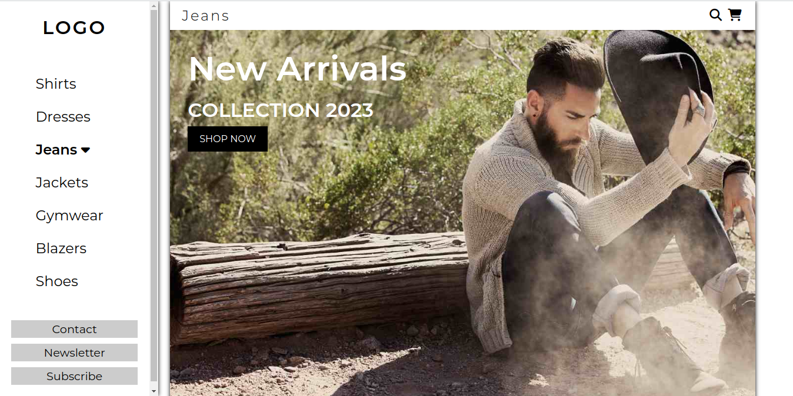
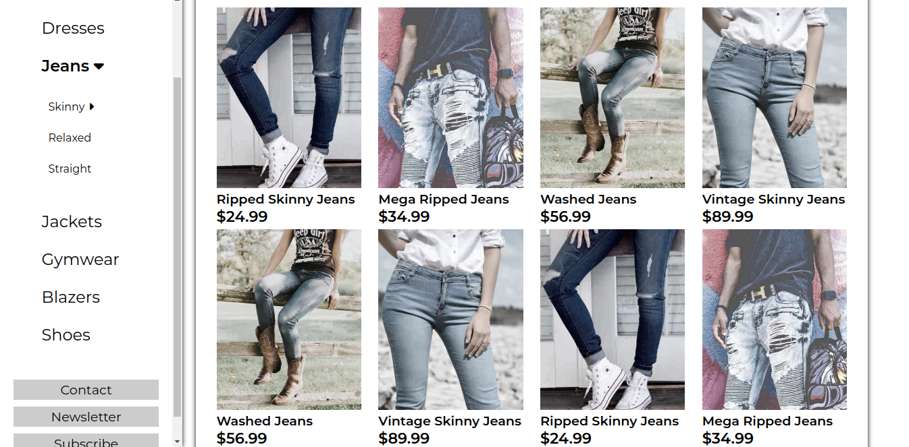
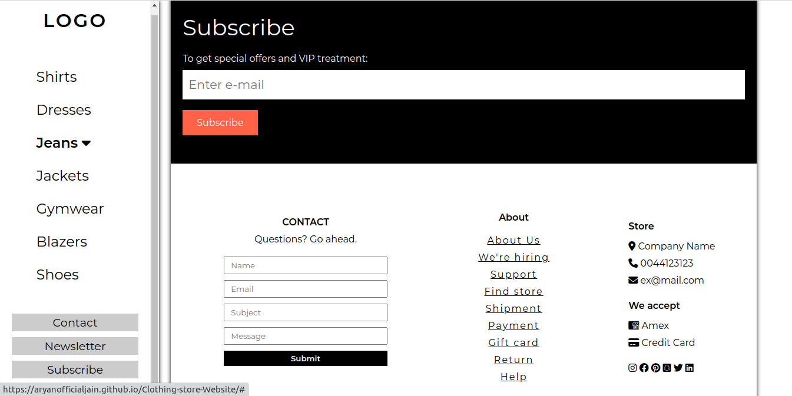

# Fashion Avenue - Clothing Store Website

Welcome to Fashion Avenue, a trendy and stylish clothing store website built using HTML, CSS, and vanilla JavaScript.

## Description

Fashion Avenue is an immersive online shopping experience that offers a wide range of fashionable clothing items for men and women. This website provides a user-friendly interface where customers can browse the latest fashion trends, view detailed product descriptions, add items to their cart, and securely place orders. The website is designed to be visually appealing and responsive, ensuring a seamless shopping experience on desktops, tablets, and mobile devices.

## Features

- Browse and search clothing items
- View product details and descriptions
- Add items to cart
- Securely place orders
- Responsive design for mobile and desktop devices

## Screenshots

Include screenshots or GIFs showcasing the website's user interface and features.

**
You can find the website live <a href="https://abhisoni1921.github.io/clothing-store/">here</a>
**
